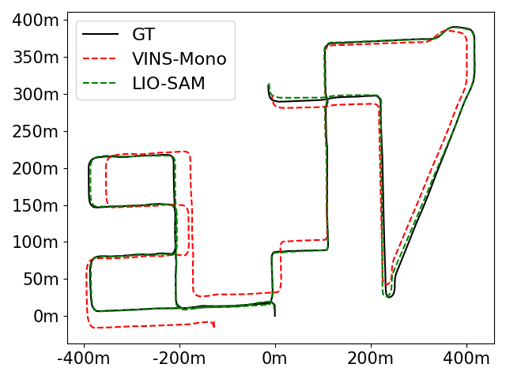
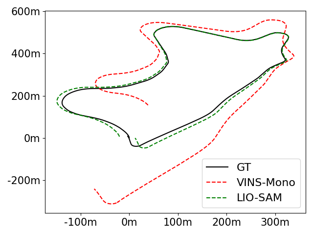

# evo_mini
mini pack to draw evo-like trajectories
# Install
```bash
pip install evo --upgrade --no-binary evo
```
# Usage
Put your tum-formatted trajectories in Directories:
```
08_4/
  GT.txt
  VINS_MONO.txt
09_4/
  GT.txt
  VINS_MONO.txt
```
and then run the `draw.py` file.
Demo Figs are shown below:
|08|09|
|---|---|
|||
